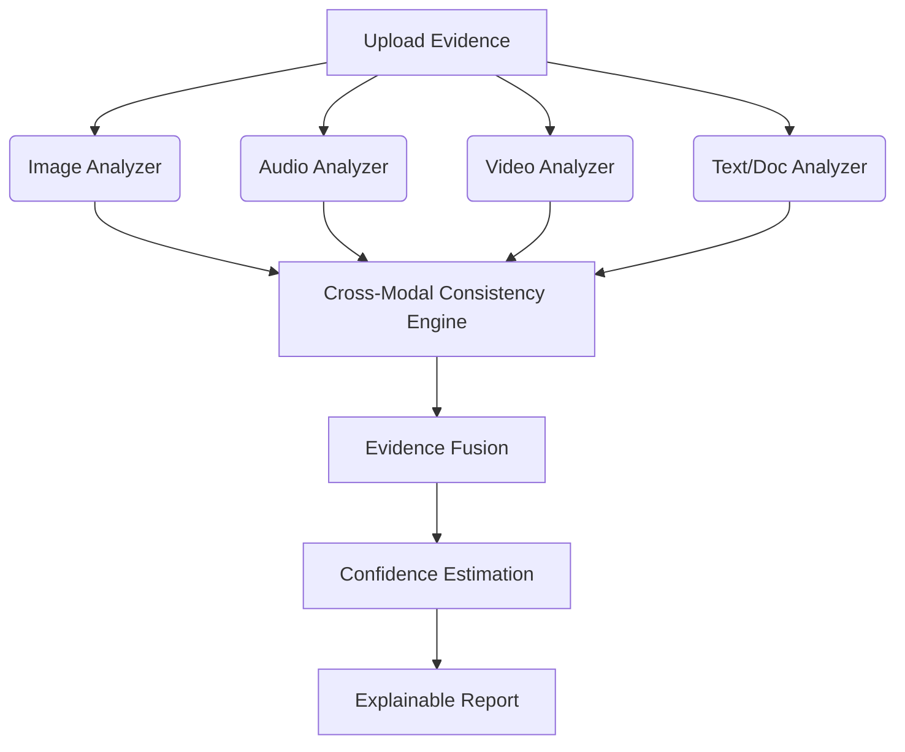

# TrustLayer

**AI-Powered Multimodal Digital Authenticity & Trust Investigation Platform**

TrustLayer is a hackathon-ready prototype designed to investigate the authenticity of digital media. Unlike traditional deepfake detectors that analyze a single image or video in isolation, TrustLayer uses a **cross-modal reasoning engine** to compare evidence across multiple modalities (image, audio, video, text, metadata) and identify coordinated manipulation.

## Problem
Generative AI makes individual digital artifacts increasingly difficult to authenticate. An image, voice recording, video, or document can individually appear convincing. However, contradictions between multiple pieces of evidence often reveal coordinated manipulation. 

## Solution
TrustLayer analyzes multiple evidence sources together. It performs:
1. Individual analysis of each modality using pretrained AI models and heuristics.
2. Feature extraction (entities, locations, dates, text, metadata).
3. Cross-modal consistency checks (temporal, location, entity, semantic, and detector agreement).
4. Evidence fusion to calculate an overall suspicion score and confidence level.
5. Explainable investigation reporting to show exactly *why* a conclusion was reached.

## Architecture



## Supported Modalities
- **Images**: JPG, JPEG, PNG, WEBP
- **Audio**: MP3, WAV, M4A
- **Video**: MP4, MOV
- **Documents**: PDF, TXT

## AI Models
- **Image Deepfake Detection**: `umm-maybe/AI-image-detector` (ViT-based, Hugging Face)
- **Audio Transcription**: `openai/whisper-base`
- **Audio Spoof Detection**: Custom lightweight spectral heuristics (librosa)
- **NLP (Entities/Dates)**: `spaCy` (`en_core_web_sm`)
- **Semantic Similarity**: `sentence-transformers/all-MiniLM-L6-v2`

## Installation

1. Create a Python virtual environment (Python 3.10+ recommended):
```bash
python -m venv venv
source venv/bin/activate  # On Windows: venv\Scripts\activate
```

2. Install dependencies:
```bash
pip install -r requirements.txt
```

3. (Optional) Ensure FFmpeg is installed on your system for video audio extraction.

## Running Locally

Start the Streamlit application:
```bash
streamlit run app.py
```

## Generating Demo Data

To run the application with sample data during a presentation, generate the demo test cases:
```bash
python test_data/generate_demo_data.py
```

## Limitations & Disclaimers
**TrustLayer is an AI-assisted investigation system. Its output is an evidence-based assessment and should not be treated as definitive forensic proof.** 

- **Heuristic Audio Spoof Detection**: Due to the unavailability of reliable lightweight pretrained audio deepfake models, the audio spoof detection relies on spectral heuristics and is marked with low confidence.
- **Model Bias**: The underlying image detector and semantic similarity models inherit biases from their training datasets.
- **Missing Modalities**: The system gracefully handles missing modalities, but confidence decreases when less evidence is available.

## Future Work
- Integration with more robust audio and video deepfake models.
- Advanced OCR and document tampering detection.
- Database integration for saving and managing past investigations.
- Enhanced graph visualizations for complex evidence webs.
